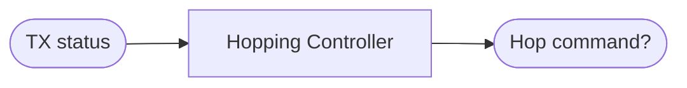

# Logica di Channel Hopping

L'API mette a disposizione il metodo hopChannel per permettere a i due peer di cambiare canale WiFi in modo sincronizzato. In generale, la decisione su *quando* debba essere effettuato un hop, è altamente legata al contesto di utilizzo del sistema, che può variare da utente a utente. Tuttavia, una ragionevole assunzione, è che il channelHop possa venire utilizzato come misura di robustezza aggiuntiva per saltare su un nuovo canale di comunicazione, qualora si misuri un notevole degrado delle performance del canale corrente.  

In questo file viene discussa la logica di channelHopping automatico implementata in questo progetto, basata sull'idea appena esposta: che può essere abilitata/disabilitata o sovrascritta da logiche user-defined a piacimento.

## Problema da affrontare

La logica di hopping ha come unico input, per ogni interazione, lo stato corrente 

