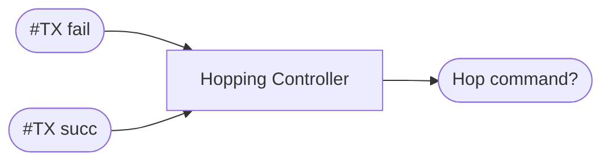

# Logica di Channel Hopping

L'API mette a disposizione il metodo `hopChannel` per permettere a i due peer di cambiare canale WiFi in modo sincronizzato. In generale, la decisione su *quando* debba essere effettuato un hop, è altamente legata al contesto di utilizzo del sistema, che può variare da utente a utente. Tuttavia, una ragionevole assunzione, è che il channelHop possa venire utilizzato come misura di robustezza aggiuntiva per saltare su un nuovo canale di comunicazione, qualora si misuri un notevole degrado delle performance del canale corrente.  

In questo file viene discussa la logica di channel-hopping automatico implementata in questo progetto, basata sull'idea appena esposta: un degrado delle performance del canale attuale innesca un hop su un canale *potenzialmente* migliore. Questa funzionalità può essere abilitata/disabilitata o sovrascritta interamente da logiche user-defined.

## Problema da affrontare

Il controllore per la logica di hopping riceve in ingresso, per ogni interazione, il numero di trasmissioni riuscite (TXS) e il numero di trasmissioni fallite (TXF). Il motivo per cui vengono usate due metriche diverse e non una stima *Quality%* condensata di "qualità di canale", è perché il controllore deve poter distinguere fra almeno 2 possibli scenari:
- non c'è stata nessuna trasmissione
- ci sono state trasmissioni con esiti diversi

Un singolo valore *Quality%* non basta per codificare entrambi gli scenari, per questo viene utilizzata la coppia (TXS, TXF) come input.

Come output, il controllore decide, per ogni iterazione, se effettuare un hop e su quale canale.

### Degradation Estimate (D) e Reputation (R)

L'idea alla base dell'innesco di un hop è monitorare in tempo reale lo stato di degrado del canale. Questo può essere fatto guardando direttamente al rapporto fra TXF/TX_TOT, ovvero alla percentuale % di trasmissioni fallite sulle trasmissioni totali durante quell'iterazione. Invece di usare il valore direttamente, costruiamo una stima di degradazione ($D \in [0,1]$) utilizzato la seguente legge di aggiornamento (Exponential Moving Average):

$$
\begin{aligned}
d_i = \frac{TXF}{(TXF + TXS)} \\\\
D_{i+1} = D_{i} + k(d_i - D_i)
\end{aligned}
$$

Dove $d_i \in [0,1]$ è il valore di degradazione percentuale instantaneo, e $D_i$ è il valore filtrato. Iterando la legge, si ha che $D$ tende esponenzialmente verso $d_i$, per un $d$ costante; nel caso di un $d$ rumoroso, $D$ si comporta come un filtro passa basso, smussando le variazioni rapide di $d_i$.

Scegliendo in modo appropriato la costante di filtraggio $k$ si può costruire un filtro di stima di D che reagisca in modo più o meno tempestivo alle perdite.

#### Quando effettuare un hop?

Una volta aver costruito una stima di degradazione (D) per il canale corrente, per scegliere se effettuare un hop è sufficiente impostare una soglia di tollerenza massima di degradazione $T_D$. Superata questa soglia critica, il canale è reputato instabile e il controllore innesca un hop a un nuovo canale. 

#### A quale canale spostarsi?

Una volta aver deciso di dover abbandonare il canale corrente, il controllore ha a disposizione di norma altri 13 canali su cui saltare. Non avendo accesso alla stima di degradazione per gli altri canali, si deve basare la scelta su un altra metrica.  

Viene introdotta la reputazione ($R \in [0,1]$) di un canale, un indicatore di *aspettativa di qualità* per ogni singolo canale. Maggiore R, più il canale è reputato affidabile. I valori di reputazione R possono essere inizializzati utilizzando conoscenze a priori sulla qualità dei canali, oppure effettuando una scansione iniziale ("profiling" dei canali). La reputazione di un canale inattivo rimane costante nel tempo; ciò permette al controllore al momento dell'hop di scegliere fra i vari canali quello che è attualmente reputato il più affidabile.  

Per il canale attivo, il valore di reputazione (R) va mantenuto aggiornato sul reale stato del canale in base delle nuove osservazioni. In particolare:
- per ogni trasmissione fallita (TXF), R penalizzata con un fattore $k_p \in [0,1]$ : $R \leftarrow R - k_pR$
- per ogni trasmissione riuscita (TXS), R è ricompensato con un fattore $k_r \in [0,1]$ : $R \leftarrow R + k_r(1-R)$

Nel corso del tempo, alti numeri di trasmissioni riuscite spingono $R \rightarrow 1$, mentre alti numeri di trasmissioni fallite spingono $R \rightarrow 0$. Più le costanti di penalità $k_p$ e ricompensa $k_r$ sono piccole, più R evolve lentamente: la reputazione è più "difficile" da cambiare, si ripone più "fiducia" nel passato del canale.
Allo stesso modo, più $k_p$ è grande rispetto a $k_r$, maggiore è l'impatto di una singola perdita sulla reputazione rispetto a un singolo successo. Di norma, $k_p > k_r$, ma una guida alla scelta più elaborata si può trovare [qui](#scelta-dei-parametri).

Poichè in una singola iterazione si possono avere sia trasmissioni riuscite che trasmissioni fallite, la legge di aggiornamento complessiva prende la seguente forma chiusa (per il calcolo, consulta --):

$$
\begin{aligned}
R_{i+1, succ} = 1 - (1 - R_i)(1-k_r)^{TXS} \\\\
R_{i+1, fail} = R_i * (1-k_p)^{TXF}
\end{aligned}
$$

$$
R_{i+1} = [R_{i+1, succ} - R_i] + [R_{i+1, fail} - R_i]
$$

### Comportamento atteso

Il sistema realizzato è basato su due livelli:
- Stima in tempo reale dello stato di degradazione del canale $D\%$ $\rightarrow$ *QUANDO effettuare hop*
- Metrica di reputazione a lungo termine per ogni canale $R$, aggiornata col tempo $\rightarrow$ *a QUALE canale saltare*

Assumendo una scelta ragionevole dei parametri $k, k_p, k_r$, il sistema riesce a far fronte a più possibili scenari:

#### Burst di perdite

In contesti reali, può capitare che un canale di comuncazione normalmente affidabile subisca un improvviso e temporaneo calo di performance, dovuto a un interferenza o ostruzione inaspettata. In questo caso, il sistema capta rapidamente il degrado del canale tramite $D$ e, in caso critico, innesca immediatamente un Hop; tuttavia, data la reazione tempestiva, la repuazione generale del canale non subisce una grande penalità e continua ad essere simile al valore precedente.

Una volta effettuato un hop, il canale di origine viene messo in timeout per un certo tempo: ciò previene che il controllore salti immediatamente indietro su di esso. In background, il controllore tenta periodicamente di saltare a canali con reputazione migliore. Se la reputazione del canale di origine continua ad essere migliore del canale corrente, una volta superato il timeout, il controllore salterà nuovamente su di esso. Se il disturbo era *effettivamente* transitorio, il sistema si trova di nuovo nello stato iniziale; altrimenti, se il disturbo ancora persiste, si ripete esattamente quanto spiegato nel paragrafo precedente.

#### Degradazione persistente del canale

Nel caso in cui il disturbo su un canale non è transitorio ma persiste e peggiora gradualmente nel tempo, oltre all'innalzamento graduale della stima di degrado $D$, le perdite sono spalmante su una finestra temporale abbastanza grande da influenzare la reputazione $R$ del canale; in altre parole, se un canale ha un peggioramento persistente e non transitorio, la sua reputazione peggiora di conseguenza. 

## Scelta dei parametri

### Scegliere $k$ e soglia di tolleranza $T_D$

$k$ è una costante temporale del filtro utilizzato per il calcolo di $D$. Un valore di $k$ maggiore risulta in un inseguimento più rapido del valore instantaneo di perdite %; un valore di $k$ minore comporta un inseguimento più lento.

In altre parole, diminuire $k$ rende il sistema più tollerante a disturbi transitori di durata più estesa, mentre un $k$ basso comporterebbe l'innesco di un hop anche per disturbi di brevissima estenzione temporale.

La soglia di tollerenza $T_D$ esprime il valore percentuale di perdite oltre le quali il canale non è più ritenuto adeguato alla comunicazione. Può essere scelto a piacimento in base alla criticità del link.

### Scegliere $k_p$ e $k_s$

Come già discusso, questi parametri sono tendenzialmente piccoli in modo da permettere alla reputazione di variare in modo sufficientemente lento da catturare la dinamica di degrato *long-term*.

Se si vuole avere una stima dell'effettiva Link-Quality (capacità di trasmettere un singolo frame), di norma è ragionevole penalizzare maggiormente le perdite rispetto ai successi ($k_p > k_s$). Questa asimmetria consente alla reputazione di erodersi anche quando il numero di trasmissioni riuscite e fallite è simile.

Tuttavia, nel contesto di **ARQ**, una trasmissione riuscita non è solo fine a se stessa, ma è il potenziale culmine di un *ARQ loop*.
Ad esempio, considerando una trasmissione ARQ che impiega 5 tentativi per avere successo, si hanno quattro trasmissioni fallite e una trasmissione riuscita. Attenendosi alla regola precedente, la reputazione subirebbe un drastico decremento (1 *"step"* positivo con $k_p$ e 4 *"step"* negativi con $k_s$).

Tuttavia, se con la reputazione R si vuole catturare l'effettiva capacità di un canale di effettuare un **Delivery end-to-end**, è ragionevole pensare che una trasmissione di successo (Delivery riuscito) abbia più valore di qualche ritrasmissione; dunque, si può pensare di impostare $k_s > k_p$ oppure $ks = G \cdot k_p$ con $G \in \mathbb{Z}$.

### Scelta del TIMEOUT di riposo

Dopo aver effettuato un hop su un altro canale, il canale di origine viene messo temporaneamente in *timeout*. Questo è per prevenire comportamenti oscillatori troppo rapidi in cui si continua a saltare in continuazione da un canale all'altro. In genere, il timeout può variare da qualche secondo a qualche minuto, in base a parametri come: 
- estenzione temporale stimata degli eventuali disturbi (burst)
- all'importanza che ha comunicare *esattamente* su quel canale.
- altri parametri *user-specific*