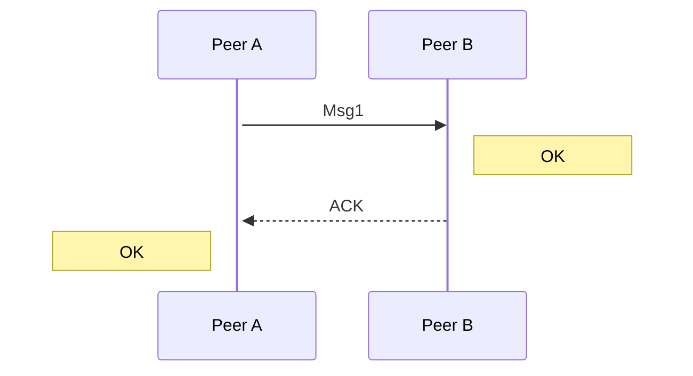

# Implementazione software di un layer di robustezza sopra ESP-NOW (per ESP8266) per comunicazione Peer2Peer
> Progetto di **Industrial Communications**.  
—  Americo Cherubini, mat. 309445. 

## Overview
ESP‑NOW è un protocollo proprietario di Espressif che permette a più dispositivi ESP8266/ESP32 di comunicare direttamente tra loro tramite pacchetti a bassa latenza, senza richiedere un access point Wi‑Fi o una connessione IP. Utilizza frame Wi‑Fi di tipo action, garantendo consumi ridotti e tempi di trasmissione molto rapidi, ideali per reti di sensori, attuatori e sistemi real‑time. L’utente può definire un proprio formato di pacchetto, gestire peer multipli e implementare logiche personalizzate di affidabilità, rendendo ESP‑NOW una base flessibile per protocolli applicativi leggeri e ad alte prestazioni.

In questo progetto viene implementato in software uno strato di robustezza per ESP-NOW, inteso prevalentemente per uso in una topologia Peer2Peer. Vengono implementati i seguenti meccanismi di affidabilità:
- **ARQ** : Ritrasmissione automatica di messaggi con mancato ACK
- **Duplicate detection** : Evita la ricezione di messaggi duplicati
- **Channel Hopping** : Cambio sincronizzato di canale WiFi di entrambi i Peer.

Funzionalità secondarie:
- **Message ID** : Ogni messaggio porta con se un ID nell'header; utilizzabile dall'utente per differenziare diversi tipi di messaggi. 


<br>

## Dettagli protocollari

### Header
A ogni pacchetto inviato viene anteposto un header che contiene:
- (1 byte) **Message ID** : utilizzo interno e user-defined.
- (4 bytes) **Nonce** : sequenza casuale generata dal mittente, usata per duplicate detection.

### ARQ

Il protocollo ESP-NOW prevede l'invio da parte del ricevente di un ACK per ogni pacchetto, che il mittente utilizza per asserire la buona riuscita della trasmissione. 

Il meccanismo di ARQ implementato fa leva su questo sistema di ACK per verificare che il pacchetto sia stato effettivamente ricevuto. In caso di perdita del pacchetto, ACK non viene mai inviato e la trasmissione fallisce†. In caso di fallimento, il pacchetto viene ritrasmesso dopo aver atteso un periodo di tempo fisso. In caso di perdita di ACK, la trasmissione fallisce e il pacchetto viene ritrasmesso, ma il ricevente si accorge che il pacchetto è duplicato (viene confrontato il nonce nell'header; se è lo stesso -> pacchetto duplicato).  
Il loop di ritrasmissione avviene fino a quando non si verifica un successo, un timeout globale dell'operazione, o si raggiunge il numero massimo di ritrasmissioni.

> *†  ESP‑NOW gestisce autonomamente il timeout dell’ACK: se l’ACK non arriva entro la finestra prevista, la trasmissione viene segnalata al mittente con un codice di errore diverso da zero.*

Il tempo di attesa fra ritrasmissioni, il tempo di attesa massimo per l'intera operazione e il numero massimo di tentativi di ritrasmissione sono configurabili attraverso i parametri protocollari (ProtocolParams).

#### Diagramma temporale per funzionamento nominale:


```
    Peer A        Peer B
    |               |
    | --- Msg1 ---> |
    |               | OK
    | <--- ACK ---- |
 OK |               |
    |               |
```
#### In caso di perdita del pacchetto:
```
    Peer A        Peer B
    |               |
    | -- Msg1 --> X |
    |               |
ACK TIMEOUT         |
WAIT                |
    | --- Msg1 ---> |
    |               | OK
    | <--- ACK ---- |
 OK |               |
    |               |
```
#### In caso di perdita di ACK:
```
    Peer A        Peer B
    |               |
    | --- Msg1 ---> |
    |               | OK
    |  X<-- ACK --- |
    |               |
ACK TIMEOUT         |
WAIT                |
    | --- Msg1 ---> |
    |               | OK (DUPLICATE, *don't invoke callbacks*)
    | <--- ACK ---- |
 OK |               |
    |               |
```

### Channel Hop
Le schede ESP8266 dispongono di una sola radio WiFi in grado di sintonizzarsi su un canale nell'intervallo 1-14 in banda 2.4 GHz. Entrambe le schede devo essere avviate sullo stesso canale per poter instaurare una connessione iniziale.   

Il meccanismo di Channel Hop permette alle schede di cambiare dinamicamente e in modo sincronizzato canale WiFi. L'Hop può essere inziato da ciascuno dei due Peer; tuttavia, per ridurre a zero il rischio di conflitti, è bene decidere a priori chi dei due Peer ha l'arbitrio sulla scelta del canale di comunicazione.

I messaggi di `HOP RQST` e `HOP ACK` utilizzano MessageID riservati (255-254), e sono inviati utilizzando ARQ.

#### Diagramma temporale per un Channel Hop sul canale 6:
```
    Peer A               Peer B
    |                       |
    | ---- HOP RQST 6 ----> |
    |                       | OK 
    | <---- HOP ACK 6 ----  |
 OK |                       |
    |                       |
SWITCH CH 6             SWITCH CH 6
    |                       |
    :                       :

communication resumes on new channel...
```

<br>

## Arduino API
La libreria è utilizzabile con *Arduino Framework*, e l'API è disponibile tramite il file header `robust_msg.h`:
```cpp
#include "robust_msg.h"
```
L'API consiste in una classe interamente statica, `RobustMsg`, che da accesso a tutte le funzionalità. I metodi principali sono:
```cpp
/* initializza il sistema su un canale WiFi e setta l'indirizzo MAC del Peer */
ErrorCode RobustMsg::initialize(uint8 wifiChannel, uint8* peerMac)
```

```cpp
/* Invia data al peer configurato implementando ARQ in base ai parametri di protocollo attuali. */
ErrorCode RobustMsg::send(uint8* data, unsigned int len, uint8 packId)
```

```cpp
/* Tenta un hop sincronizzato al nuovo canale WiFi */
ErrorCode RobustMsg::hopChannel(uint8 newChannel)
```

Consultare i file per esempi di utilizzo concreti e per documentazione più dettagliata.
