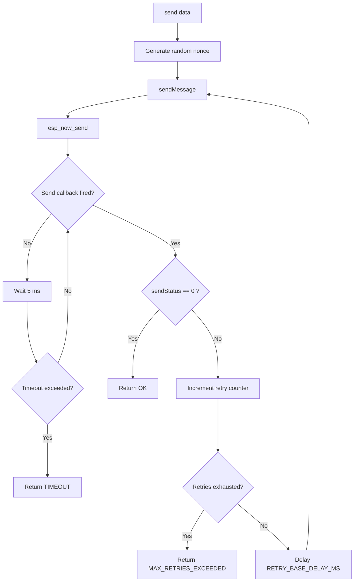
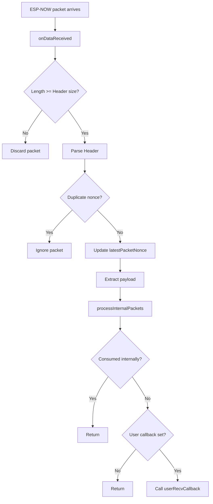
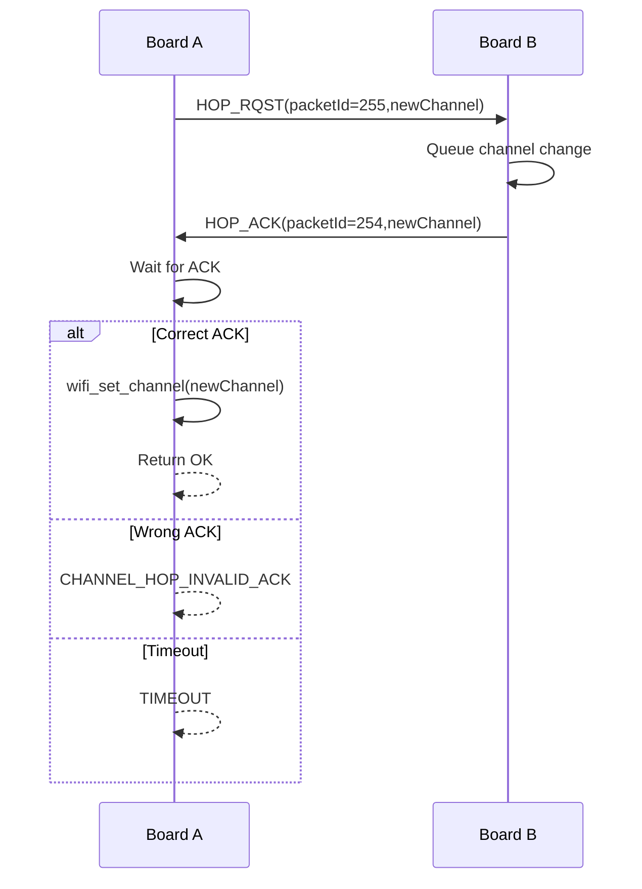
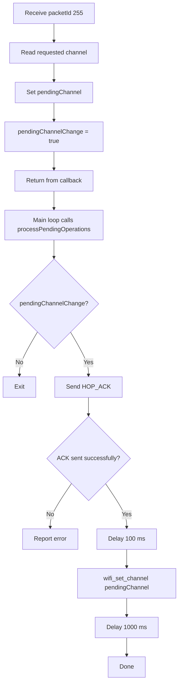

### 1. ARQ Send Flow

---

### 2. Receive Packet Flow

---

### 3. Channel Hop Initiator

Called by `hopChannel(newChannel)`.

---

### 4. Receiver Side Channel Hop Processing

This happens after receiving a hop request.

